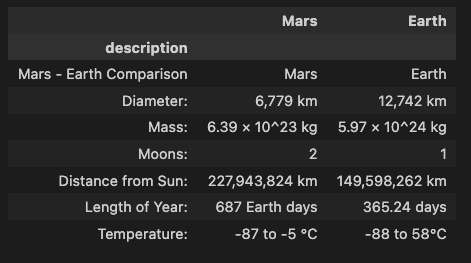

## Overview

This project used Python to scrape news headlines, images, and data from around the web and present it on its own website using flask and mongo And BeautifulSoup.  I used Java to write the `index.html` file with links to a stylesheet to make the page pop with embedded content and customizable features.  

## Results

In the first deliverable, I used a for loop including splinter to iterate through the ‘button’ tags on the URL and click on the image links.  Using BeautifulSoup I was able to parse the resulting HTML and store the images and titles in the hemispheres dictionary as `img_url` and `title` keys respectively to present on my own Mission to Mars page. 

 

For the second deliverable, I added the new field in the Mongo database and updated the HTML to present the full-size images, and updated the font color to stand out against the black and white background as shown here:

 
 

The web page I created also works on a mobile device, and automatically resizes the content in line to fit.

 

## Challenges

This project was especially difficult for me, with a lot of trial and error and searching through documentation.  One obstacle I was unable to overcome was how to present the ‘Mars Facts’ table info I scrapped and transformed into a DataFrame.  As you can see when written into HTML the table is, well, underwhelming.

    
